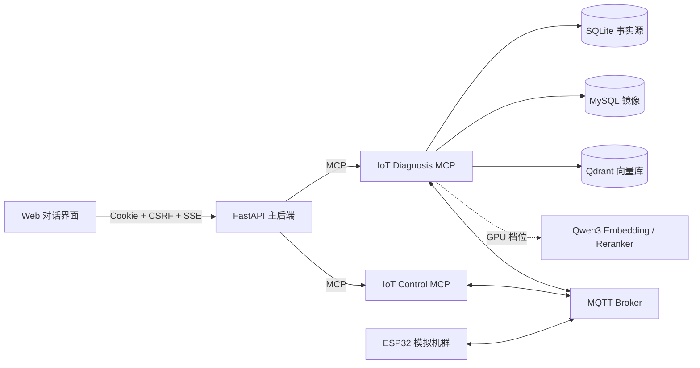

# 小yi：面向 IoT 的通用智能体

小yi 是一个 ChatGPT 风格的 IoT 智能运维 Agent。它把设备状态、日志、知识检索、故障诊断、修复审批和恢复验证串成一条可审计的闭环：

> 发现异常 → 汇集证据 → 生成诊断 → 选择动作 → 执行或审批 → 验证恢复 → 沉淀案例

浏览器只访问 FastAPI 主后端；设备与知识查询由 **IoT Diagnosis MCP** 提供，修复动作由独立的 **IoT Control MCP** 提供。低风险动作可自动执行，高风险动作必须由用户在界面中批准。

## 核心能力

- **对话式诊断**：基于设备状态、遥测、日志、知识文档和已验证案例回答问题，并保留证据与诊断追踪。
- **混合 RAG**：结构化分块，Dense + BM25 召回、RRF 融合和 Reranker 重排；支持无模型下载的 Portable 档位和 Qwen3 GPU 档位。
- **闭环修复**：自动执行低风险动作；高风险动作生成审批卡，批准后下发命令并验证恢复。
- **持续学习**：已验证的自动修复结果通过 MQTT 事件回写故障案例库。
- **可靠运行**：运行恢复、SSE 事件缓冲、上下文预算、消息分页、数据保留、结构化日志、就绪探针和 Prometheus 指标均已内置。
- **本地可演示**：Docker Compose 默认启动 12 台 ESP32 模拟设备，无 API Key、GPU 或模型下载也能体验完整链路。

## 系统架构



两个 MCP 服务只通过 MQTT Topic 契约共享设备事件，不直接耦合。主后端负责认证、对话、Agent 运行、MCP 接入策略和审计边界。

## 快速开始

### 1. 准备环境

- Docker Desktop（包含 Docker Compose）
- Node.js `>= 22.13.0`（运行前端）
- Python `>= 3.12`（仅本地开发或运行维护脚本时需要）

主项目与 MCP 服务是两个独立仓库，目录必须保持如下关系：

```text
xiaoyi/
├── backend/
├── frontend/
├── mcp-services/       # 独立 Git 仓库
├── compose.yaml
└── README.md
```

首次克隆：

```powershell
git clone https://github.com/fireworksfade/xiaoyi.git
cd xiaoyi
git clone https://github.com/fireworksfade/xiaoyi-mcp-services.git mcp-services
```

### 2. 启动后端与 IoT 服务

默认使用 Portable 检索和确定性的 Mock Agent Runtime：

```powershell
docker compose up -d --build
docker compose ps
```

首次启动或重建数据卷后，注册并启用两个 MCP 服务：

```powershell
docker compose exec backend python scripts/bootstrap_local_mcp.py
```

### 3. 启动前端

```powershell
cd frontend
npm ci
npm run dev
```

打开 [http://localhost:3000](http://localhost:3000)，使用本地演示账号登录：

| 角色 | 用户名 | 密码 |
| --- | --- | --- |
| 管理员 | `admin` | `admin123` |
| 操作员 | `operator` | `operator123` |

这些账号只用于本地开发，禁止用于生产环境。

### 4. 停止服务

```powershell
docker compose down
```

普通停止不会删除命名卷中的对话、知识库或设备数据。只有明确需要重置数据时才应删除卷。

## 服务与端口

| 服务 | 地址 | 说明 |
| --- | --- | --- |
| Web 前端 | `http://localhost:3000` | 对话、审批与运行记录 |
| FastAPI | `http://127.0.0.1:8000` | 主后端及 `/api/v1` API |
| IoT Diagnosis MCP | `http://127.0.0.1:9001/mcp` | 查询、检索与诊断 |
| IoT Control MCP | `http://127.0.0.1:9002/mcp` | 动作、审批与恢复验证 |
| MQTT | `127.0.0.1:1883` | 本地设备消息总线 |
| MySQL | `127.0.0.1:3306` | 诊断数据镜像 |
| Qdrant | `http://127.0.0.1:6333` | 知识与案例向量库 |
| Retrieval Models | `http://127.0.0.1:9010` | 仅 GPU 档位启动 |

## 检索部署档位

| 档位 | 启动命令 | 检索实现 | 环境要求 |
| --- | --- | --- | --- |
| Portable（默认） | `docker compose up -d --build` | 384 维 hash embedding + weighted reranker | Docker；无 GPU、无模型下载 |
| GPU | `docker compose -f compose.yaml -f compose.retrieval-gpu.yaml up -d --build` | Qwen3-Embedding/Reranker-0.6B，1024 维 | NVIDIA runtime；建议至少 4 GiB 空闲显存；首次下载约 2.5 GiB |
| GPU offline | GPU 命令追加 `-f compose.retrieval-offline.yaml` | 使用已缓存的 Qwen3 模型并禁止联网 | 模型缓存必须完整 |

Portable 与 GPU 档位分别使用 `iot_diagnosis_portable` 和 `iot_diagnosis_qwen3` 集合，避免不同向量维度混写。

模型服务的 `/live` 表示进程存活，`/ready` 仅在两个模型加载完成后返回 200。离线缓存不完整时会返回 503 和 `MODEL_CACHE_INCOMPLETE`，不会尝试联网下载。

## 自主运维闭环

IoT Control MCP 按风险策略处理设备动作：

- 重连 MQTT/WiFi、传感器校准、调整上报间隔等低风险动作可由 Agent 直接执行并轮询验证。
- 重启设备、固件升级等高风险动作只生成修复提案；用户在聊天审批卡中批准后才会执行。
- 命令通过 `iot/{device_id}/cmd` 下发，设备返回 `cmd_ack`；控制服务在验证窗口内根据状态和日志判断是否恢复。
- 恢复成功后发布 `iot/{device_id}/remediation` 事件，诊断服务将结果保存为已验证故障案例。

## 模拟机群

`iot-simulator-fleet` 根据 `mcp-services/iot_diagnosis/fleet.json` 模拟 12 台 ESP32，覆盖车间、仓库、冷库、配电房、锅炉房和温室等位置：

- 8 台健康设备；
- 1 台 MQTT 超时设备；
- 1 台 WiFi 弱信号设备；
- 1 台传感器卡死设备；
- 1 台周期性掉线并自愈的网络不稳定设备。

修改 `fleet.json` 后运行以下命令即可重载：

```powershell
docker compose restart iot-simulator-fleet
```

设备友好名称仅在首次注册时写入；已有数据卷不会自动覆盖旧名称。

## 知识摄取与评测

在 `mcp-services` 目录中摄取 TXT、Markdown 或 PDF：

```powershell
..\backend\.venv\Scripts\python.exe -m scripts.ingest_documents .\docs\mqtt-guide.pdf --source mqtt_docs --document-id mqtt-guide --title "MQTT Guide"
```

相同 `document-id` 会原子替换旧分块。运行确定性 RAG/Router 评测：

```powershell
..\backend\.venv\Scripts\python.exe -m scripts.evaluate_rag --database .\data\iot_diagnosis_eval.db
```

在 GPU Compose 档位中运行真实 Qwen3 检索评测：

```powershell
docker compose -f compose.yaml -f compose.retrieval-gpu.yaml exec iot-diagnosis-mcp python /app/scripts/evaluate_rag.py --profile live-retrieval --database /app/data/iot_diagnosis.db
```

## 配置说明

### Agent Runtime

Compose 默认设置 `AGENT_RUNTIME=mock`，无需模型密钥即可稳定演示。需要接入 OpenAI Agents SDK 时，可在本地后端配置中设置：

```text
AGENT_RUNTIME=openai
OPENAI_API_KEY=your-api-key
OPENAI_MODEL=your-model
```

本地开发以 `backend/.env.example` 为模板。容器部署时应通过安全的环境注入或 Compose override 覆盖配置，不要提交密钥。

诊断服务也可通过 `DIAGNOSIS_LLM_API_KEY`、`DIAGNOSIS_LLM_MODEL` 和 `DIAGNOSIS_LLM_BASE_URL` 接入兼容 Chat Completions 的模型；未配置时会明确使用启发式回退。

### 存储与鉴权

诊断服务以 SQLite 为本地事实源，异步镜像到 MySQL，并把知识文档和已确认案例写入 Qdrant。外部写入失败时会进入 SQLite outbox 后台重试，写入结果会标记为 `complete` 或 `pending`。

可在启动前覆盖本地数据库密码：

```powershell
$env:MYSQL_PASSWORD = "change-this-password"
$env:MYSQL_ROOT_PASSWORD = "change-this-root-password"
docker compose up -d --build
```

生产环境应设置 `DIAGNOSIS_MCP_BEARER_TOKEN` 保护 MCP 端点，并用相同凭据重新注册：

```powershell
docker compose exec backend python scripts/bootstrap_local_mcp.py --credential "replace-with-a-long-random-token"
```

## 健康检查与可观测性

- 主后端：`GET /live` 检查进程，`GET /ready` 检查数据库、迁移、Dispatcher 和必需 MCP，`GET /metrics` 暴露 Prometheus 指标。
- Diagnosis MCP：`GET /health` 检查进程，`GET /ready` 检查存储、outbox 和检索模型。
- Control MCP：`GET /health` 检查进程，`GET /ready` 检查控制服务就绪状态。
- 应用日志使用 JSON 结构化输出，并在可用时携带 `request_id`、`run_id`、`trace_id`、`device_id` 和 `error_code`。

快速查看容器状态与日志：

```powershell
docker compose ps
docker compose logs -f backend iot-diagnosis-mcp iot-control-mcp
```

## 本地开发

### 后端

```powershell
cd backend
python -m venv .venv
.venv\Scripts\python -m pip install -e ".[dev]"
Copy-Item .env.example .env
.venv\Scripts\python -m uvicorn app.main:app --reload --port 8000
```

### 前端

```powershell
cd frontend
Copy-Item .env.example .env.local
npm ci
npm run dev
```

前端默认通过同源代理请求 `/api/backend/api/v1`，再转发到 `BACKEND_BASE_URL`。这让本地和线上共用 Cookie、CSRF 与 SSE 链路，无需依赖第三方 Cookie。

两个服务启动后，可验证登录、会话、消息与 SSE 真实链路：

```powershell
cd backend
.venv\Scripts\python scripts/smoke_frontend_backend.py
```

## 测试

主仓库：

```powershell
# 后端
cd backend
.venv\Scripts\python -m ruff check app tests scripts
.venv\Scripts\python -m ruff format --check app tests scripts
.venv\Scripts\python -m mypy app
.venv\Scripts\python -m pytest -q tests

# 前端
cd ..\frontend
npm run lint
npm run format:check
npm run typecheck
npm test
npx playwright install chromium
npm run test:e2e
npm run build
```

MCP 仓库（不得导入主后端 `app.*`）：

```powershell
cd mcp-services
python -m pip install -e ".[dev]"
python -m ruff check common iot_diagnosis iot_control model_service scripts tests
python -m ruff format --check common iot_diagnosis iot_control model_service scripts tests
python -m mypy common iot_diagnosis iot_control model_service
python -m pytest -q tests
```

## 项目结构

| 路径 | 职责 |
| --- | --- |
| `frontend/` | React 对话界面、修复审批与运行记录 |
| `backend/` | 认证、对话、Agent 运行、MCP 管理、审计与可观测性 |
| `mcp-services/` | 独立仓库：Diagnosis MCP、Control MCP、模型服务、MQTT 接入与模拟器 |
| `deploy/` | 本地基础设施配置 |
| `specs/` | RAG 与 IoT MCP 设计规格 |
| `compose*.yaml` | Portable、GPU 和离线检索部署编排 |

开发 Broker 仅绑定 `127.0.0.1` 且允许匿名连接，只适合本机联调。实验室或生产环境必须启用身份认证、TLS 和 Topic ACL，并关闭演示账号自动播种。
