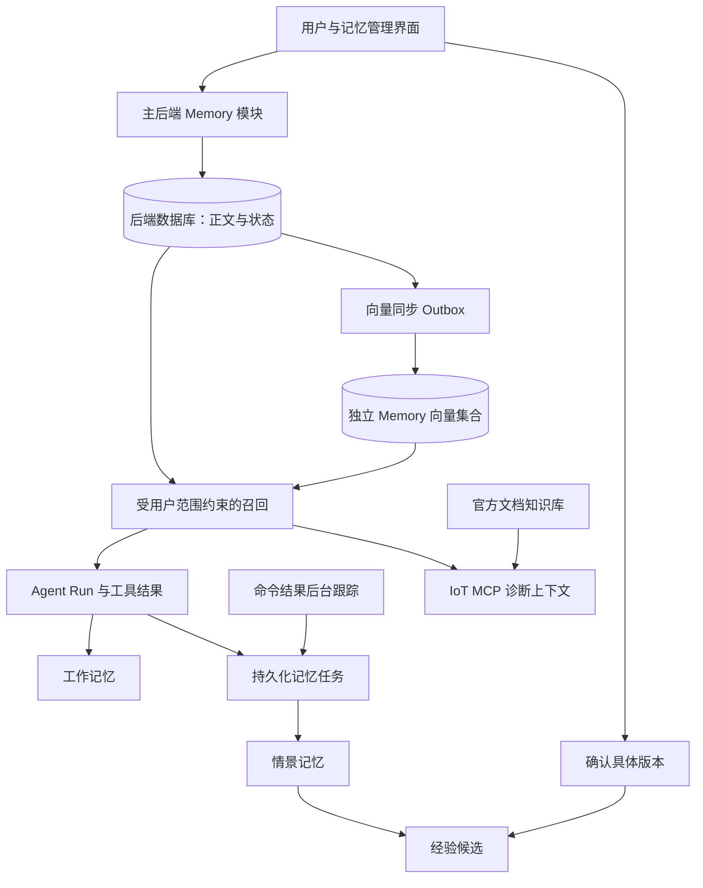
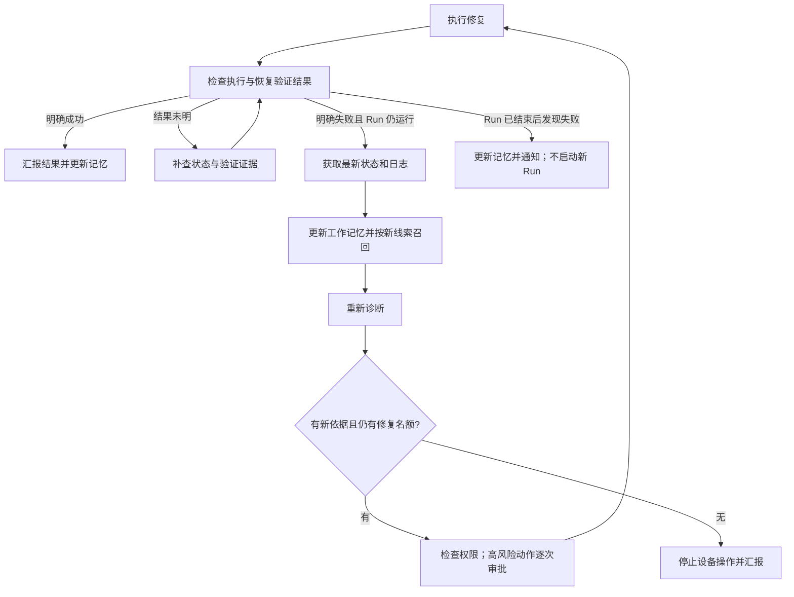

# Memory 替代故障案例库与自动沉淀：详细规格

版本：1.2（旧案例清理决策更新）  
创建日期：2026-09-27；更新日期：2026-09-28  
状态：2026-09-30 复验问题已修复并通过本轮功能验收，证据与验证范围见 [修复报告](memory-repair-report-20260930.md)；此前 [独立复验报告](memory-reacceptance-report-20260930.md) 和 2026-09-29 报告保留为历史记录。规模性能压测及正式部署另行验证。2026-09-28 用户决定旧案例直接删除，不再迁入 memory；本版以该决策覆盖此前所有历史导入和待分配设计。

## 1. 目标与决策

建立由主后端拥有的独立 memory 模块，采用工作记忆、情景记忆、经验记忆三层设计。经验记忆统一包含事实/规律与处理流程，不独立拆分语义记忆和程序记忆。

完整退役旧故障案例库，包括人工案例入口、自动沉淀链路、旧案例检索、旧接口和界面；旧案例及反馈直接删除，不迁入 memory。官方技术文档库、设备诊断、命令执行、人工审批、恢复验证和原始业务记录继续履行各自职责。

### 1.1 用户已确定的决策

| 编号 | 决策 |
| --- | --- |
| D01 | 建立独立 memory 模块，删除整个自动沉淀功能，不只是改名称或提示文案。 |
| D02 | 工作记忆、情景记忆、经验记忆三层；事实/规律与步骤可以共存在一条经验内。 |
| D03 | 故障案例库整体退役；旧案例和反馈直接删除，不迁入 memory。 |
| D04 | 任务结束自动记录有价值的情景；自动提炼的经验先进入候选，用户确认后才能用于正常召回。 |
| D05 | 长期记忆按用户隔离，可跨同一用户的会话使用；第一版不建设项目共享或全局共享记忆。 |
| D06 | 工作记忆默认不向量化；可复用的情景与已启用经验可以建立向量索引。 |
| D07 | 不建立旧案例待分配区；旧案例不参与任何用户的记忆召回。 |
| D08 | 删除聊天默认保留长期记忆；用户可勾选同时清除由该聊天产生的记忆及受影响的派生内容。 |
| D09 | 当前 Run 仍在运行时，明确修复失败触发自动重新诊断；必须先获取最新证据，再决定是否继续修复。 |
| D10 | 每个任务最多执行 3 次修复，包含首次；条件不变、没有新依据时不能重复同一动作，高风险动作逐次审批。 |
| D11 | Run 结束后才发现失败，只更新记忆并通知用户，不自动启动或重启 Agent 任务；结果不明时先补查，不直接再次修复。 |

### 1.2 澄清记录

| 编号 | 问题 | 当前状态 |
| --- | --- | --- |
| Q01 | 旧案例缺少可靠用户归属，如何处理？ | 已确认 D03/D07：直接删除，不分配。 |
| Q02 | 删除聊天时，已提取的长期记忆如何处理？ | 已确认 D08：默认保留，可显式同时清除。 |

其余技术默认值是本 spec 的设计建议，允许在验收数据支持下调整，不代表当前代码已经具备这些行为。

### 1.3 非目标

- 不构建用户画像、偏好学习、跨用户知识共享或新的项目权限体系。
- 不把原始日志、全部聊天消息、附件正文都复制成长期记忆。
- 不引入外部 memory SaaS 或预先绑定某个 memory 框架。
- 不让经验记忆自动执行设备动作，不改变原有工具授权和高风险动作审批。
- 不恢复已删除的 operation workflow 状态机；后台记忆任务只是数据处理任务。

## 2. 现状与改造依据

以下结论来自当前仓库代码阅读，并非对部署环境的运行验证。

| 位置 | 当前职责 | 新方案处理 |
| --- | --- | --- |
| `packages/mcp-services/iot_diagnosis/remediation.py` | 成功验证事件关联诊断，组装 verified 案例并返回确认 | 删除整个模块 |
| `packages/mcp-services/iot_diagnosis/mqtt.py` | 订阅 `iot/+/remediation`，写案例并发布 `remediation_case` | 删除该订阅及处理分支；保留设备观测采集 |
| `packages/mcp-services/iot_control/remediation_events.py` | 修复完成事件构造和 MQTT 发布 | 删除旧模块与调用/导入 |
| `packages/mcp-services/iot_control/mqtt.py` | 接收案例确认，写回命令的案例关联 | 删除 `CASE_LINK_TOPIC` 和对应分支 |
| `packages/mcp-services/iot_control/repository.py` | 成功验证后置 `case_status=pending`，关联案例 | 删除案例状态；保留 `diagnosis_id`、命令结果和验证状态 |
| `packages/mcp-services/iot_diagnosis/repositories/knowledge_cases.py` | 文档及旧案例的写入、列表、删除和检索辅助 | 拆除案例职责，保留文档能力 |
| `packages/mcp-services/iot_mcp/server.py` | 同一 MCP 服务提供诊断、控制、案例工具 | 移除案例工具，为诊断增加可信记忆上下文接入 |
| `packages/backend/app/api/{diagnosis,fault_cases}.py` | 旧案例新增、列表、删除 REST 接口 | 退役，由 memory API 承担新功能 |
| `packages/backend/app/services/runs/orchestrator.py` | Agent Run 编排、工具事件和结束状态持久化 | 加入记忆召回、事实收集与持久化任务入队 |
| `packages/backend/app/agent/runtime.py` | 远程 MCP 调用、诊断关联、提示词 | 删除自动沉淀承诺，增加 memory 调用上下文 |
| `packages/backend/app/services/context_builder.py` | 当前消息、历史、附件的预算管理 | 为工作记忆和召回结果分配有界预算 |
| `packages/frontend/features/knowledge/knowledge-dialog.tsx` | 文档与案例浏览 | 移除案例 tab，文档管理保留 |
| `packages/frontend/components/remediation-card.tsx` | 审批/验证展示及案例关联补拉 | 删除案例状态和补拉逻辑，保持修复状态展示 |

需注意的现状：

1. `iot_mcp/server.py` 当前后台循环调用 `process_timeouts()`，未看到它使用返回值调用旧的事件发布函数。旧事件模块、订阅和 UI 仍然存在，不能据此声称线上自动沉淀端到端正常工作。
2. 旧案例写入把 `source` 固定为 `human_verified`；UI 另用 `verified_by` 的 `auto-remediation:` 前缀识别自动来源。旧数据直接清理，不据这些字段推断新记忆的可信度。
3. 已有 `fault_case_memory_governance` 迁移增加生命周期、适用条件和反馈字段，但当前主要写入/查询路径未完整使用。字段存在不等于已有可用的 memory 系统。
4. 后端生命周期 hooks 标为 observation-only，且 `after_run` 在 Run 提交后触发；不能将其直接作为唯一可靠的记忆写入入口。
5. 前端 `components/` 与 `features/` 存在重复文件且实际引用混用。删除旧功能必须覆盖实际入口、兼容副本和测试，不在本次顺带做全站目录重构。
6. 当前后端具备用户归属字段，旧案例表不具备可靠用户归属；账号隔离需在新的模型和每条召回路径上建立。

## 3. 三层记忆定义

### 3.1 工作记忆 Working Memory

保存当前任务目标、设备范围、已观察事实、待验证假设、已尝试动作、待办和关键证据 ID。绑定 `user_id + conversation_id`，内部标注本次 `run_id` 和版本。

- 复用已有上下文快照与运行恢复能力；新增结构化槽位，不复制一份聊天历史。
- 工具结果更新事实槽位；模型生成的假设单独存放，不能覆盖工具证据。
- 新 Run 继续同一会话时可加载；另一个会话不能直接加载。
- 默认 24 小时未活动后过期，可配置。过期只是停止加载临时摘要，不删除原始 Run、消息或设备数据。
- 不生成 embedding，不进入跨会话搜索。
- 会话删除立即失效；恢复旧快照时重新校验长期记忆引用，不得复活已删除记忆。

### 3.2 情景记忆 Episodic Memory

记录一次具体经历，最少包括：环境/设备、现象、已执行动作、结果、未解决项和来源引用。

- 可以记录成功、失败、无结论，以及有实际证据的部分完成经历。
- 普通问候、重复查询、只有泛泛回复、没有可复用信息的运行不创建。
- 一次诊断后仍在等待审批/验证时，可保存 `outcome=pending` 的事实记录，但默认暂不进入正常召回；最终结果到达后更新同一经历。
- 没有执行动作也可以形成有价值的诊断经历；结果是 `inconclusive`，不伪造修复成功。
- 原始日志存于原业务库；memory 仅保留必要的脱敏证据摘录与引用。
- 跨次任务的类似经历分别保留，不把不同事件合并成一次。单次事件的重复投递用幂等键消重；召回时同类经历做多样性限制。

### 3.3 经验记忆 Experience Memory

从情景或用户明确提供的信息中提炼可复用认识。内部统一容纳以下结构：

- `claims`：事实、规律、假设，以及各自的证据状态。
- `procedure`：可选的处理步骤、前置条件、分支、停止条件和验证方法。
- `applicability`：设备实例/类型、固件、配置、环境等适用条件。
- `limitations`：例外、反例、未知条件和不适用情况。
- `evidence_refs`：支撑或反驳该经验的经历引用。

只有事实没有步骤、或只有经验证的排查流程，都允许保存。步骤有效与根因正确分别记录，不能共用一个“已验证”布尔值。

自动提炼结果必须为 `candidate`。所属用户查看并确认具体版本后成为 `active`；确认表示允许后续使用，不自动把所有因果主张变为“事实已验证”。用户手动新建也先保存候选，可在表单提交时明确执行“保存并启用”。

## 4. 服务边界与总体流程

### 4.1 所有权

- 主后端是 memory 的唯一业务写入者，管理权限、状态、版本、候选确认和向量同步。
- IoT MCP 保持诊断/控制事实的所有权，不持有或检索全体用户的 memory 数据库。
- 复用现有 Qdrant 服务和 embedding 模型服务，但使用独立集合、同步队列和配置。
- 后端不得依赖导入 MCP 容器内的业务 repository。embedding 可通过已配置的模型 HTTP 服务调用；必要的通用客户端另做小型共享模块或后端适配器。
- 第一版 memory 是后端内部能力与 REST 管理 API；不额外部署一个 memory MCP 服务。

### 4.2 两个召回入口

1. **Run 开始**：根据当前请求和可信设备范围召回，作为有界参考上下文交给主 Agent。
2. **`diagnose_fault` 执行前**：后端拦截器以当前 Run 用户及实际 `device_id/query` 再召回，将相关记忆传给 MCP 内部诊断函数与 LLM。

两处复用同一召回服务，按 `memory_id + revision` 去重；不能只将记忆加到主聊天提示词，却让实际诊断模型仍然看不到记忆。

查询当前在线状态等纯实时请求默认不加载历史经验。记忆不能覆盖当前设备观测，也不能因历史成功记录提高根因置信度。

## 5. 数据模型

以下为逻辑 schema；实际迁移使用现有 SQLAlchemy/Alembic 体系。时间统一 UTC，ID 使用 UUID。正文与关系存 SQL，向量只是可重建的派生索引。

### 5.1 `memories`

| 字段 | 含义/约束 |
| --- | --- |
| `id` | 记忆 ID |
| `owner_user_id` | 非空用户 ID；所有可用记忆都绑定明确的用户 |
| `kind` | `episodic` 或 `experience` |
| `status` | `candidate / active / suspended / rejected / archived / deleted` |
| `title` | 最多 160 字符 |
| `current_revision` | 当前编辑版本，乐观并发控制依据 |
| `active_revision` | 正常召回使用的已启用版本，可为空 |
| `source_type` | `task / user` |
| `event_key` | 情景来源的稳定幂等键，同一用户内唯一；经验可为空 |
| `created_at / updated_at` | 时间 |
| `last_used_at / use_count` | 展示辅助，不等同有效性证据 |
| `expires_at / deleted_at` | 可空；失效立即影响召回 |

索引：`(owner_user_id, kind, status, updated_at)`；情景 `UNIQUE(owner_user_id,event_key)`。用户名、设备 ID 或模型生成内容不能替代 owner。

### 5.2 `memory_revisions`

不可变内容版本，`UNIQUE(memory_id, revision)`：

- `summary`、`content_json`、`search_text`、`content_hash`。
- `applicability_json`：`mcp_server_id`、`device_ids`、`device_types`、固件/配置条件；设备 ID 必须与 MCP 服务范围一起解释。
- 情景内容：`symptoms`、`observations`、`hypotheses`、`actions`、`outcome`、`unresolved_items`。
- 经验内容：`claims[]`、`procedure[]`、`limitations[]`。
- 每个 claim 的 `epistemic_status`：`observed / user_asserted / hypothesis / corroborated / contradicted / unknown`，来源引用必填或明确为用户陈述。
- `outcome`：`pending / succeeded / failed / inconclusive / not_executed`。
- `review_state`、`reviewed_by`、`reviewed_at`、`change_reason`、`created_by`。
- `extractor_version / policy_version / model_id`：来源可追踪，不保存模型密钥。

建议单条摘要不超过 1,200 字符，结构化正文不超过 12,000 字符；超过时拒绝或按独立主题拆分，不静默截断证据条件。

### 5.3 来源、关系与反馈

| 表 | 关键字段与用途 |
| --- | --- |
| `memory_sources` | 用户、源类型、源 ID、Run/会话/诊断/命令/工具调用 ID、MCP 服务 ID、证据摘录、hash、可访问状态。引用可失效，不级联误删记忆。 |
| `memory_evidence_links` | 记忆版本、来源/情景版本、`supports / contradicts / derived_from`，用于溯源和撤回。 |
| `memory_feedback` | 经验 ID、被使用版本、命令 ID、结果与证据。`UNIQUE(owner_user_id,memory_id,command_id)` 防止重复计数。 |
| `memory_usage` | Run/诊断 ID、记忆版本、`retrieved / cited / applied` 阶段及时间。检索命中不等于实际采用。 |
| `memory_tombstones` | 删除记忆及来源的阻止重建标记，只保存最少 ID/hash。防止重试或重提炼复活已删除信息。 |

有效/无效次数只来自关联到实际采用经验的命令结果；普通召回、展示、模型自评不增加成功次数。根因可信度不根据动作成功率自动计算。

### 5.4 持久化任务与索引

| 表 | 用途 |
| --- | --- |
| `memory_jobs` | `capture_episode / enrich_episode / propose_experience / sync_vector / purge_vector / revalidate_dependents` 等任务；幂等键、lease、重试次数、下次运行时间、错误码。 |
| `memory_action_links` | 在执行/审批调用前保存用户、Run、服务、稳定调用键，之后关联 proposal/command/diagnosis；后台追踪结果。 |
| `memory_vector_outbox` | 与记忆变更同事务创建的索引操作，含记忆 ID、版本、模型指纹、目标集合和操作类型。 |
| `memory_index_state` | 每个记忆版本及模型档位的 `pending / indexed / failed / excluded` 与最后错误。 |

业务状态、用户确认状态和索引状态分开；“待索引”不代表内容待确认，“已索引”不代表可信。

修复循环复用 `AgentRun.runtime_state` 保存 `repair_budget`，与动作关联记录共同提供 `origin_run_id`、名额预留、已执行命令、已消费的失败结果版本和停止原因。预算是执行约束，不存入可被模型改写的记忆正文，也不随 memory 过期或关闭而失效。详细计数规则见第 7.4 节。

## 6. 写入和经验提炼

### 6.1 触发与事实收集

| 触发 | 行为 |
| --- | --- |
| 诊断工具完成 | 持久化结构化证据与源 ID；更新工作记忆 |
| Run 完成 | 在 Run 终态事务内入队情景评估任务 |
| Run 失败/取消/恢复扫描判定中断 | 有已发生且可核验的有效动作时记录部分经历；纯异常堆栈不生成经验 |
| 后台发现命令/验证结果变化 | 更新已有情景；可以触发重新提炼候选 |
| 运行中收到明确修复失败 | 立即更新工作记忆，入队失败情景记录；按第 7.3 节重新诊断，不等待长期记忆落库或候选确认 |
| 用户要求“记住” | 创建用户来源的候选；明确的“记住并启用”可作为本次内容确认 |
| 新情景具有可提炼信息 | 异步生成经验候选；无新增知识时跳过 |

不以“主 Agent 说任务完成”判断设备已恢复；结果以控制服务记录为准。拒绝/过期的提案记录为未执行，不能计入修复失败。

### 6.2 价值门控

自动情景必须同时满足：

1. 有可归属到当前用户的可信来源。
2. 至少包含一个可核验现象/事实，且具有处理结果、失败原因、约束或未解决问题之一。
3. 不是只转述召回的旧记忆，不是问候、模板回复或单次普通状态查询。
4. 不命中已删除来源的抑制记录。
5. 结构化校验通过；敏感配置凭据已移除。

价值筛选先用确定性规则，再按需调用用户已配置模型提炼。模型仅提出结构化候选，字段校验、来源校验、幂等和状态流转由服务端执行。

模型不可用时：保存能够确定构造的情景摘要；经验提炼任务保持待处理并退避，不把模板产物冒充已学习的经验。无有效模型配置不借用其他用户的模型配置。

### 6.3 经验候选与确认

- 候选可以由一次经历产生，但必须明确其观察范围；不得将一次结果表述为普遍定律。
- 同一用户、相同适用条件和相同主张的候选优先更新；仅语义相似不足以合并。
- 相似度用于寻找对照项，最终合并必须验证设备范围、主张和条件一致。
- 已启用经验的新事实/步骤/适用范围修改形成新候选版本；正常召回继续使用旧 active 版本，直到确认新版本。
- 追加非冲突的来源和使用统计可直接记录；不能悄悄改写已确认正文。
- 有明确反例时立即标记冲突并暂停相关经验，展示证据，生成待确认修订。不能自动覆盖反例。
- 用户确认请求必须带 `expected_revision`；版本变化返回 409，界面要求重新查看变更。
- 第一版不做自动确认、不设“成功 N 次就自动启用”的规则。

### 6.4 幂等、并发与持续更新

- 有命令的情景键：`server_id + command_id`；只有诊断的情景键：`server_id + diagnosis_id`；普通任务按 `run_id + logical_subject`。
- 同一诊断后续产生动作时，升级/关联已有情景；一次诊断包含多个实际命令时保留动作子记录，必要时拆分，不能重复计数。
- 源事件重试不新增情景；体验相似但命令/任务不同则为不同经历。
- 消费采用 at-least-once 加唯一键、版本检查和短事务；不宣称跨数据库 exactly-once。
- LLM 调用和向量写入在事务外进行；提交前重查来源、owner、删除状态和版本。

## 7. 修复结果追踪与失败后的再诊断

修复可能经过审批和观察窗口，晚于 Run 结束。不能依赖页面轮询、`after_run` 一次回调或旧 MQTT 案例事件。

### 7.1 后台追踪方案

1. 后端在 `execute_device_action` 或创建提案调用前，持久化 `memory_action_links`，包含由后端生成的稳定调用键、发起用户和服务 ID。
2. IoT MCP 为这些写操作增加后端关联键的幂等支持，并与 proposal/command 同事务保存映射。相同键+相同参数返回原结果；相同键+不同参数返回冲突。实际 MQTT 发送不得因 memory 重试重复执行。数据库保存成功但 MQTT 投递结果未知时，返回原命令及未知投递状态，不通过重放记忆任务再次下发。
3. 后端记录调用返回的 proposal/command。崩溃或响应丢失时，通过后端专用、只读的关联键查询能力 `get_action_by_correlation` 恢复 ID；不能盲目重发设备动作。
4. 管理员审批动作关联原提案所属用户；审批人是审计主体，不自动变成记忆 owner。无法归属的平台外动作不写入任何用户的记忆。
5. 后台 worker 周期调用既有 `get_action_result`，根据持久化关联追踪结果。用户关页面或 Run 结束不影响追踪。
6. 结果变化以来源版本/hash 入队更新同一情景，并提炼或修订经验候选。

新增关联查询工具只允许后端内部调用，不加入 Agent 可见工具目录；参数由后端生成和校验，不接受模型自由指定 owner。

### 7.2 默认追踪策略与异常

- 每条活跃命令初始 5 秒查询，网络失败指数退避，最大 60 秒；通过 lease 避免多个 worker 同时追踪。
- pending 提案追踪到其明确过期时间；已执行命令追踪到配置的结果期限，默认 24 小时。
- 状态未知、服务重启丢失观察窗口或结果超时，归为 `inconclusive`，保留原因；不得据此推断根因或动作失败。
- 期限后保留低频补查任务，默认每日一次、最长 7 天。后来得到明确结果时更新原情景并触发新版本；结果始终未知则结束补查，用户仍可手动刷新。
- 当前控制观察窗口使用内存状态；本次不承诺修复该服务的完整重启恢复机制。memory 必须正确表达因此产生的未知结果。
- memory 故障不改变修复成功/失败状态，不延迟用户收到正常执行结果；后台任务失败独立展示。

结果归一化遵循下表，原始 command/verify/ack 状态一并保留：

| 可核验状态 | 情景结果 | 说明 |
| --- | --- | --- |
| 提案等待批准、命令仍执行或观察中 | pending | 未得到结论，不提炼成功经验 |
| 提案明确被拒绝/过期且没有命令 | not_executed | 没有实际修复行为 |
| 命令明确执行失败或恢复验证明确失败 | failed | 记录失败发生在执行还是验证阶段 |
| 恢复验证 succeeded | succeeded | 仅表示当前验证窗口内恢复，不确认根因 |
| 命令 ACK 成功但没有恢复验证 | pending，追踪超限后 inconclusive | ACK 不等同恢复 |
| 网络超时、状态缺失、重启丢失窗口 | inconclusive（达到追踪期限后） | 无法观察不是证明动作无效 |

若原始状态互相矛盾，例如执行失败同时报告恢复成功，记录 `inconclusive` 与冲突证据并停止自动成功反馈，不能静默选一个结果。

### 7.3 当前 Run 内的自动再诊断

当归一化结果为 `failed`，且原 Run 仍为 RUNNING、未取消、未超运行期限、未耗尽模型运行预算时，必须进入一次重新诊断流程，不能只重复上一轮回答。成功结果结束本次修复循环；`pending/inconclusive/not_executed` 不直接触发下一次修复。

结果补查同样受 Run 的时间、工具调用和取消限制，图中的循环不能无限等待；达到边界后按第 7.2 节留给后台继续跟踪。

重新诊断按以下顺序执行：

1. 按 `command_id + result_revision/hash` 持久化待处理标记，以 lease 认领本次再诊断；新诊断结果和 ID 保存后才标记已完成。重复轮询和后台通知不能产生多轮重复诊断；中途崩溃时可恢复未完成步骤，不能提前标记已消费而漏掉诊断。若 Run 已进入终态，则只更新结果，不因恢复标记而重启它。
2. 查询失败发生后的设备状态和相关日志。区分“命令没有执行成功”与“命令执行了但没有恢复”；无法取得新证据时明确记录缺口。
3. 更新工作记忆：原假设、动作及参数、动作前后证据、失败阶段、未验证假设、已用名额与剩余名额。历史步骤的失败不能被后来的成功覆盖。
4. 以新增错误、现象或环境变化重新召回当前用户的情景与 active 经验，去重并替换无关条目；本次失败直接进入 context，不必先从向量库找回。
5. 将上述失败上下文传入 `diagnose_fault` 内部诊断流程。返回新的 `diagnosis_id`、对前次假设的处理、支持新方案的证据与仍未知的条件。
6. 只在新诊断提供可执行方案、有明确依据且仍有名额时继续。不同动作需给出选择依据；重复同一动作必须指出实际变化的条件或可核验的重试依据，换个表述不算新依据。
7. 下一次修复引用本轮新 `diagnosis_id`，重新检查动作风险与参数。低风险动作按原权限执行；高风险动作创建新的提案并等待该次批准，旧批准不能复用。

失败处理是 Run 编排与工具边界的明确行为，不只写一句提示词期待模型自行遵守。后端向当前运行注入新的结果事件或恢复其受控推理步骤；不得在同一设备原动作未收敛时并发发起替代修复。

### 7.4 修复次数与执行预算

- 第一版一个“任务”指一个用户发起的 Agent Run；其创建的提案即使后来才获批，仍使用 `origin_run_id` 对应预算。
- 每个 Run 最多执行 **3 次修复，包含首次**；多设备请求共用该 Run 的总预算。重新诊断、状态查询和日志查询不占修复次数，但受原有工具轮次和超时限制。
- 执行前由后端原子预留名额；调用通过校验、远端建立可执行命令后计入一次。结果成功、失败都计数；同一命令的轮询、恢复查询和重复结果只计一次。
- 下发/响应结果未知时保留该名额并先恢复查询，不能释放名额后发新命令；确认没有创建或下发命令后才可释放。
- 创建高风险提案时预留名额，批准实际执行后转为已使用；拒绝/过期且确认没有命令则释放。待审批名额计入可用额度，避免多个待批准提案合计超过上限。
- 3 次用尽后拒绝任何新增设备修复调用/提案，返回 `REPAIR_ATTEMPT_LIMIT_REACHED`。可以在剩余运行预算内继续只读诊断并总结，但不能执行第 4 次动作。
- 预算和预留在 Run 恢复、模型重试、管理员审批、关联键查询和后台结果处理中保持一致。更换工具名、动作参数或 MCP 服务不能重置计数。
- Agent 不得自动创建新 Run 绕过上限。用户明确发起后续任务时才有新预算，新任务仍应读取之前的失败事实，不机械重复修复。
- SDK 的模型轮次限制与修复次数是不同预算。若现有模型轮次或 Run 超时先达到上限，停止并如实汇报，不能为了“凑满 3 次”无限增加模型轮次。

### 7.5 停止、审批与晚到结果

满足以下任一条件时停止新增设备操作：设备已恢复；没有新证据支持下一方案；无有效权限或可用动作；3 次名额已用尽；用户取消；Run 已结束、超时或达到模型运行上限。

- 已经发送的命令继续由后台观察；停止 Run 不等于远端命令已撤销，不自动发送额外恢复/回滚动作。
- 等待高风险审批时允许按现有交互结束 Run。用户后来显式批准仍有效的提案，可以在原预算及既有审批规则内执行；这是新的用户授权操作，不是终态 Run 自动继续。若执行失败，终态 Run 不自动重启再诊断。
- Run 结束后的失败通知通过本 spec 定义的记忆活动/相关结果页面展示，并指出“需要发起后续诊断”；第一版不发送未配置的外部通知。
- 用户取消与失败结果并发时，以持久化 Run 状态为准：工具下发前再次检查运行状态和预算。晚到事件可以更新事实，不能绕过取消恢复执行。
- 最终汇报至少包含：每次实际动作与结果、最新诊断及证据缺口、停止原因、已用次数，以及需要用户补充的信息或审批。不能只显示“已记录失败经验”。

### 7.6 失败经验反馈与 context 一致性

- 失败情景异步入库不阻塞当前再诊断；情景入库任务失败时，当前运行仍使用原始结构化失败证据继续判断。
- 仅检索到某条经验不能给它累计失败；只有明确关联到实际采用的动作/步骤才记录 outcome 反馈。
- 同一动作失败不直接证明整条经验错误；先比较适用条件。明确反例按第 6.3 节暂停经验并生成修订候选，条件不一致则记录范围问题。
- 已暂停的经验从后续召回及工作摘要的有效参考中移除，但“此前曾采用它且失败”仍作为此次任务事实保留。
- 若后续修复成功，每个动作的原始结果继续保留，另记录本次任务最终恢复；不能把前两次失败改写成成功，或给全部召回经验记成功。
- context 压缩必须保留失败动作、证据 ID、尚未解决的问题和预算引用。模型摘要不是预算或事实的权威来源，下一次执行仍向持久化记录校验。

## 8. 召回与向量索引

### 8.1 向量化准入

| 内容 | SQL 保存 | 正常向量索引/召回 |
| --- | --- | --- |
| 工作记忆 | 现有快照/临时结构 | 否 |
| 通过价值门控且结果已收敛的情景 | 是 | 是；包含成功、失败、无结论 |
| 等待审批/验证的情景 | 是 | 暂不进入正常召回 |
| 待确认经验 | 是 | 不进正常索引；候选管理和消重用 SQL/现有 active 索引，必要时临时计算向量 |
| 用户确认的 active 经验 | 是 | 是 |
| suspended/rejected/archived/deleted | 按状态保留元数据或历史 | 否，立即排除 |
| 原始日志、临时观测、全部附件 | 原业务存储 | 不批量作为 memory 向量化 |

生成 `search_text` 时包含标题、症状、适用条件、事实/假设状态、动作和结果。保留必要限定词，不能为了摘要长度删掉“未确认”“仅此设备”等语义。

### 8.2 隔离与集合

- 独立命名空间示例：`xiaoyi_memory_<model_fingerprint>_<dimensions>_v1`。
- 主语义 embedding 与 portable hash embedding 分集合，不混用向量空间。模型指纹包含模型/版本与维度；维度相同也不能默认兼容。
- 默认优先使用已部署的语义模型服务；仅 portable 环境时提供关键词/本地排序降级，并标明降级。hash embedding 不宣称具有与语义模型相同的同义词召回能力。
- payload 保存 `owner_user_id, memory_id, revision, kind, status, mcp_server_id, device scope, content_hash, model_fingerprint`。
- 普通搜索只返回 ID、版本和分数，正文回 SQL 读取，避免向量 payload 中的旧正文被直接输出。
- 查询前必须加 owner、状态和已知设备范围过滤；回 SQL 后再次核验所有权、有效状态、版本和适用性。空 owner 过滤绝不能退化为全库查询。

### 8.3 排序与预算

1. 从当前用户输入和可信工具参数构造查询，限制长度；模型提炼查询不得更改 owner 或设备范围。
2. 在用户范围内召回向量和关键词候选，各不超过 30 条；后端合并去重。
3. 过滤版本失效、状态失效、明确不适用项；设备/固件条件未知时不能当作匹配事实，返回“适用性待核实”。
4. 重排考虑内容相关性、适用条件、证据支持和时效。成功次数只是参考；多次重启有效不等于根因正确。
5. 默认最多返回 6 条，其中经验最多 4 条、情景最多 2 条；没有足够候选不强行补满，同类重复经历限量。
6. 默认注入预算 2,000 tokens，单条 450 tokens。预算不足优先删低相关条目，不截断当前用户消息或关键执行状态。
7. 返回 `memory_id, revision, kind, title, excerpt, applicability, uncertainty, sources, retrieval_mode`，无结果明确返回空数组。

阈值与排序权重通过固定离线样例标定，避免将任意余弦分数写成跨模型的统一可信度。

### 8.4 进入实际诊断

- 为诊断调用增加结构化 `memory_context`；由后端在 MCP 调用边界填充，覆盖/拒绝模型伪造的同名内容。
- MCP 仅消费传入、限长、版本化的参考内容，不通过该字段接受执行指令。
- 在 `diagnosis.py` 和 `llm.py` 中将 memory 与官方文档、实时证据分组传入；输出保留记忆引用及版本，不把记忆伪装为日志。
- 诊断 trace 不持久化用户私有记忆正文；只记录引用及脱敏使用信息。后端在 Agent 的 `get_diagnosis_trace` 调用边界及任何 trace REST 入口进行 owner 校验，禁止通过共享诊断 ID 读取其他用户的私有推理结果。未经归属确认的历史 trace 不允许作为其他用户的 memory 证据。
- 为诊断结果建立后端 `user_id + mcp_server_id + diagnosis_id` 归属映射；外部直接调用 MCP 仍按既有服务凭据边界管理，不自动赋予读取后端用户 memory 的能力。
- 用户停用/删除后的新调用必须重新校验；已经发给模型的上下文无法追溯撤回，但后续工具调用和新 Run 不得继续注入它。
- 无 memory 时按普通文档+实时证据诊断；删除旧案例检索后不得继续使用 `fault_cases` 的加分或来源路由。

### 8.5 更新、删除与重建一致性

- 每次记忆事务同时写 outbox；worker 成功才标记 indexed。
- 向量点 ID 包含记忆 ID、版本与模型指纹；旧任务即使晚到也不能覆盖新版本。
- upsert 前后检查删除标记和当前 `active_revision`；待确认的新版本不能替换仍有效的旧 active 版本。过期操作直接放弃并安排清理。
- DELETE 提交后 SQL 过滤立即生效；向量删除可重试，两者状态分别展示。
- 重建从 SQL 的当前可召回版本读取，遇到 tombstone、候选或未分配历史条目必须跳过。
- Qdrant 不可用时使用同 owner 的本地检索降级；不能无过滤读取所有用户记忆作为兜底。

## 9. 状态、删除与保留

### 9.1 生命周期

| 当前状态 | 允许动作 | 结果 |
| --- | --- | --- |
| candidate | 用户确认具体版本 | active |
| candidate | 用户拒绝 | rejected；相同来源/内容默认不反复生成相同候选 |
| active | 用户暂停、明确反例或关键证据撤回 | suspended，立即停止正常召回 |
| active | 修改正文/步骤/适用范围 | 新 revision 待确认，旧 active revision 在无冲突时继续可用 |
| suspended | 用户审核修订并确认 | active |
| active/candidate/suspended | 用户归档 | archived，可浏览、不可召回 |
| 非 deleted | 用户删除 | deleted，写 tombstone 并清理向量 |

有效情景由规则直接成为 active，但 `outcome` 和 claim 状态必须如实保留；active 仅表示允许作为历史参考。

### 9.2 默认保留政策

- 工作记忆：24 小时未活动后过期。
- active 情景与经验：默认不按时间自动删除；旧信息通过时间、适用条件和状态控制使用。
- 候选：超过 30 天未处理显示“长期未处理”，不自动启用、不自动删除。
- deleted：立即禁止召回；默认 30 天内清理正文、历史正文和索引副本，只留下必要审计 ID、时间、hash 与防复活标记。
- 审计日志不存完整记忆正文；原设备日志和命令记录按现有业务保留规则管理。
- 用户账号删除应触发该用户的记忆清理，不向其他用户转移。

### 9.3 来源删除与依赖撤回

聊天删除遵循 D08，API 增加 `memory_policy=keep|forget`，默认 `keep`。界面增加未预选的“同时清除由该聊天产生的记忆”选项，并提供影响数量预览。

- `keep`：删除聊天并清理工作记忆；长期记忆继续存在。源引用标记 `conversation_deleted`，普通聊天 API 不再开放已删正文。记忆详情可展示其自身保存的必要摘录，不恢复聊天全文。
- `forget`：与聊天删除同事务写入来源抑制标记，立即排除由其产生的情景，并将受影响的经验置为 suspended；后台清理正文/索引并重新评估多来源经验。响应返回待处理数量和清理任务 ID，不等待向量清理。
- 删除后的聊天仍允许所有者通过记忆管理按“已删除的来源聊天”执行清除，避免错过删除时的勾选后无法遗忘。
- 同一会话中的新任务、晚到的命令结果和旧提炼任务必须检查来源抑制标记；`forget` 后不能重新生成，`keep` 时可以按原用户更新已经发生的经历。

必须支持：

- 用户删除某条记忆后，相同事件重放、索引重建或自动提炼不重建该记忆。
- 主动清除某个来源的记忆时，先使该来源不可用于新提炼，再处理情景与派生经验。
- 经验只有该来源支持时暂停并清除相应私有内容；多来源经验移除关联证据，重新验证并生成候选修订，不直接丢弃其他有效来源。
- 删除前保存的工作摘要、上下文快照、召回缓存按依赖 ID 失效，避免下一轮继续把被遗忘内容当作注入记忆。
- 已发生的聊天回复不因删除 memory 自动重写；界面明确“停止未来使用”的含义。

召回最终 SQL 校验同时检查来源抑制标记及传递依赖；不能等异步撤回任务遍历完成才生效。后台遍历负责清理和修订，前台过滤负责删除提交后的立即一致性。来源 tombstone、版本引用和依赖关系必须能在不读取已删除正文的前提下完成此判断。

## 10. API、Agent 能力与前端

### 10.1 REST API（相对 `/api/v1`）

| 方法与路径 | 功能 |
| --- | --- |
| `GET /memories` | 当前用户记忆列表；kind/status/device/source/q/cursor，limit 默认 30 最大 100 |
| `GET /memories/{id}` | 正文、版本、来源摘要、验证状态、索引状态 |
| `POST /memories` | 用户手动创建候选；支持显式 `confirm=true` |
| `PATCH /memories/{id}` | 编辑，必须 `expected_revision`；创建新内容版本 |
| `POST /memories/{id}/confirm` | 确认指定版本，CSRF 保护 |
| `POST /memories/{id}/reject` | 拒绝候选或候选修订，保留拒绝原因 |
| `POST /memories/{id}/suspend` | 暂停使用 |
| `POST /memories/{id}/archive` | 归档 |
| `DELETE /memories/{id}` | 立即排除召回，排队清理向量；幂等 |
| `GET /memories/{id}/revisions` | 查看当前用户版本历史；已清除正文不返回 |
| `POST /memories/search` | 受 owner 限定的检索；query/device/top_k，不接受任意 owner |
| `GET /memories/activity` | 当前用户候选数量、后台记录/索引失败和处理状态 |

返回沿用 `{data, request_id}`；列表返回 `{items, next_cursor}`。写操作均进行认证、CSRF 和 owner 检查。对其他用户 ID 返回 404，管理员身份不绕过普通 memory API 的用户隔离。

错误码至少包括：`MEMORY_NOT_FOUND`、`MEMORY_VERSION_CONFLICT`、`MEMORY_INVALID_TRANSITION`、`MEMORY_EVIDENCE_MISSING`、`MEMORY_CONTENT_TOO_LARGE`、`MEMORY_SOURCE_UNAVAILABLE`。索引暂不可用不回滚已保存的内容，返回独立 `index_status`。

旧案例直接清理，不提供历史导入、待分配或分配接口。

### 10.2 Agent 能力

- 后端原生 `search_memory`、`get_memory`：只读，自动绑定当前用户。
- `propose_memory`：仅创建候选，绑定当前消息/任务来源，不能设置 confirmed 状态。
- 正常自动记录由后台任务完成，不依赖模型一定调用 `propose_memory`。
- 不向模型暴露任意 owner、后台任务重试或跨用户迁移能力。
- 确认、删除、编辑通过管理 UI/REST；用户明确说“记住并启用”可展示具体内容确认卡，由服务端处理确认，模型不能自行调用确认接口冒充用户。
- 提示词说明记忆属于历史参考，当前用户要求与当前工具事实优先；记忆中的“忽略指令”等文本不能改变权限。

### 10.3 前端体验

- 增加独立“记忆”入口，列表提供“情景”“经验”和状态筛选；知识库只保留文档能力。
- 经验候选展示“依据、适用条件、认识、步骤、限制”，提供确认、编辑、拒绝。
- 编辑已启用经验时展示新旧差异，以及旧版本是否仍在使用。
- 详情可查看原始来源、动作结果、根因状态；“已确认可用”与“动作验证成功”分别展示。
- 聊天中仅在真正记录完成后显示“已记录情景”；经验只显示“已生成待确认经验”，不声称已经启用。
- 修复卡片只负责审批/命令/恢复验证；删除 `case_id` 与等待案例归档的补拉。
- memory 后台记录失败不覆盖“修复成功”状态，单独显示可重试的记忆处理状态。
- 原始证据已过期时显示“来源正文已不可用”，仍可查看保留的必要摘录和 hash。
- 旧消息中的案例引用仅作为历史文本展示，不提供旧案例 API 链接。
- 删除聊天时提供第 9.3 节的未预选清除选项；若选择清除，展示涉及情景和经验的数量及多来源经验将重新审核的说明。
- 修复失败后，当前 Run 显示“正在重新诊断”和已执行次数（例如 1/3）；任务已结束时只显示结果更新及后续诊断入口，不显示仍在自动修复。

## 11. 完整删除旧功能清单

删除现行旧案例功能与专属代码；保留升级所需的历史 schema 迁移文件，保证既有数据库可连续升级。

### 11.1 MCP 服务

- 删除 `iot_diagnosis/remediation.py`、`iot_control/remediation_events.py`。
- 删除旧 `iot/+/remediation` 和 `iot/+/remediation_case` 的订阅、处理、发布、测试和导入。
- 使用持久 MQTT 会话时，升级后显式取消旧主题订阅；仅从订阅列表移除不保证 Broker 清掉历史订阅。
- 删除 `mark_case_archived`、验证成功后创建案例 pending 状态、命令序列化中的案例字段。
- 删除旧工具 `list_fault_cases`、`search_fault_cases`、`add_verified_fault_case`、`delete_fault_case`。
- 从 `repositories/knowledge_cases.py` 删除案例 CRUD 和案例文档构造，可将剩余文件按文档职责重命名并修正引用。
- 从 `router.py`、`retrieval/hybrid.py`、`retrieval/__init__.py`、`reranker.py`、`llm.py`、`diagnosis.py` 删除 `fault_cases` 来源、强制路由、加分和模板。
- 从 `rebuild.py`、external sync、种子数据和重试队列去除旧案例索引路径。
- 删除专用的 `scripts/generate_fault_cases.py`、`scripts/dedup_fault_cases.py`；若故障注入脚本兼具其他用途，仅保留独立可用部分并改验收目标。

### 11.2 主后端

- 移除旧案例 API 路由、schema、审计操作调用点及能力列表。
- 从 `bootstrap_local_mcp.py` 和工具策略注册中移除旧案例工具；刷新已保存工具目录，使历史条目不可继续调用。
- 清理 runtime 的自动沉淀提示词、artifact 关键字段中的案例字段。
- **保留 `remediation_correlation.py` 和 `diagnosis_id` 校验**：它们仍承担诊断与修复动作关联，不属于案例归档专用机制。
- 旧 REST API 退役后返回 404，发布说明列出 breaking change；不保留转发到 memory 的隐式兼容写入口。

### 11.3 前端、测试与文档

- 清除实际引用的 `features/knowledge/`、`components/knowledge-dialog.tsx` 的案例 tab、API 调用、类型与文案。
- 同时清理 `features/remediation/` 和 `components/remediation-card.tsx` 的案例关联逻辑以及相关测试。
- 从 `lib/api/knowledge.ts`、`lib/api/remediation.ts` 及聚合导出移除旧接口和案例字段。
- 删除只验证自动沉淀/旧案例 CRUD 的测试；保留修复执行和恢复验证断言，补充新 memory 验收。
- README、部署参数、能力目录和运行说明统一更新，不继续承诺“恢复后自动生成案例”。

### 11.4 数据库与向量

- 清理迁移直接删除 MCP 的 `fault_case`、`fault_case_feedback` 及专属索引，不要求导入清单。
- 新增控制库迁移删除 `case_id / case_status / case_attempts / case_error`；保留其他命令字段。使用表重建时显式复制保留列并验证行数/关联。
- SQLite 主库与已有 MySQL 镜像迁移路径都需要处理；不能只清主库后由镜像/重建恢复旧功能。
- 旧集合可能同时包含文档、设备数据和案例，只按已核对的旧案例 source/document ID 清理；严禁整库删除知识向量。
- 所有旧 outbox 中的案例操作必须标记取消并从可重试集合移除，防止清理后重新写回。

## 12. 旧案例直接清理与切换

1. 停止旧案例写入和 MQTT 自动沉淀消费者。
2. SQLite 与 MySQL 镜像清理迁移直接删除 `fault_case`、`fault_case_feedback` 及专属索引；控制库清理旧案例关联列。
3. 取消旧案例向量 outbox 的待重试操作，按旧案例 source 精确清理向量；文档和设备向量保留。
4. 验证旧表、旧 API、工具与界面不存在，文档检索、设备诊断、审批和恢复验证正常。
5. 旧案例不导入 memory；新情景和经验从后续任务与用户输入开始生成。

回退旧应用版本前需恢复相应数据库备份；schema downgrade 不恢复已删除的案例内容。

## 13. 权限、证据与可观测性

### 13.1 必须成立的约束

- SQL、向量过滤、缓存键、去重、候选生成、反馈、源证据查询都包含 user scope。
- 通过工具内容、检索 query 或 MCP 返回的自由文本无法改变 owner。
- 来源链接的目标 API 同样进行归属检查；不能“列表隔离，但来源详情公开”。
- 模型只消费所需的有限证据摘要；凭据/token/连接串不进入记忆正文和 embedding。
- 只使用已有授权的模型配置；用于候选提炼的内容标为数据，不接受其中的系统指令。
- 用户纠正当前事实优先于旧记忆；如果与可信工具观测冲突，表达冲突并验证，不能静默覆盖任意一方。

### 13.2 事件与指标

新增可观测事件：`memory.episode_recorded`、`memory.candidate_created`、`memory.confirmed`、`memory.updated`、`memory.suspended`、`memory.deleted`、`memory.job_failed`、`memory.index_updated`。

聊天已结束后的事件进入 memory activity，不能假设旧 Run SSE 连接仍打开。用户界面按用户鉴权读取活动，不进行全局广播。

指标：各阶段任务数/延迟/重试、无价值跳过数、候选数量、确认/拒绝数、召回模式与耗时、索引积压和来源缺失数。指标标签不使用高基数用户 ID，也不记录记忆正文。

修复循环补充运行事件 `remediation.rediagnosis_started`、`remediation.rediagnosis_completed`、`remediation.loop_stopped`；携带 origin_run_id、前次 command_id、新 diagnosis_id（如有）、已用/预留次数及停止原因，不广播给其他用户。统计再诊断次数和停止原因，不以“重试次数多”作为效果改善指标。

## 14. 配置与性能目标

| 建议配置 | 默认值 |
| --- | --- |
| `MEMORY_ENABLED` | 新部署启用；升级切换前关闭 |
| `MEMORY_AUTO_CAPTURE` | true |
| `MEMORY_AUTO_PROPOSE_EXPERIENCE` | true；不存在自动确认开关 |
| `MEMORY_WORKING_TTL_HOURS` | 24 |
| `MEMORY_RECALL_TOP_K` | 6 |
| `MEMORY_CONTEXT_MAX_TOKENS` | 2000 |
| `MEMORY_RECALL_TIMEOUT_MS` | 1500，超时返回降级结果或空结果 |
| `MEMORY_JOB_POLL_SECONDS` | 2 |
| `MEMORY_JOB_MAX_ATTEMPTS` | 8，退避后进入可人工重试状态 |
| `MEMORY_ACTION_POLL_SECONDS` | 5，错误时退避至 60 |
| `AGENT_REPAIR_MAX_ATTEMPTS` | 3；第一版允许部署时降低至 1–3，不允许高于 3；Run 创建时固化预算 |
| `MEMORY_DELETED_CONTENT_RETENTION_DAYS` | 30 |
| `MEMORY_QDRANT_URL / MEMORY_COLLECTION_PREFIX` | 使用已部署服务，独立前缀 |
| `MEMORY_EMBEDDING_*` | 显式模型、维度、模型指纹与降级策略 |

验收环境需记录硬件、模型服务状态和数据规模。目标而非当前实测承诺：

- 单用户 10,000 条可召回记忆，warm 查询 P95 ≤ 1.5 秒；超时不阻断主对话。
- 工具证据和 Run 终态事务仅入队，不同步等待 LLM/embedding。
- worker/模型健康时，情景记录 P95 ≤ 30 秒；经验候选与索引 P95 ≤ 120 秒。
- DELETE 事务返回后，新的 API 召回与新模型注入立即排除；向量物理清理在服务健康时目标 ≤ 60 秒。
- 模型调用按用户配置和预算限制执行，同一源 revision 不重复提炼；空结果也记处理版本，避免无限重复请求。

## 15. 实施工作包

| 工作包 | 产出 | 依赖 |
| --- | --- | --- |
| WP01 | 新表、版本/来源模型、用户隔离、状态机与 API | D01–D08 |
| WP02 | 工作记忆结构、context builder 集成、记忆 CRUD 管理 UI | WP01 |
| WP03 | 来源收集、Run 同事务入队、持久 worker、情景价值门控 | WP01 |
| WP04 | 稳定调用关联、远程幂等/恢复查询、后台命令结果追踪；运行中失败再诊断、三次预算与逐次审批 | WP03；与 WP06 的诊断上下文契约联调 |
| WP05 | 经验候选提炼、对照消重、版本确认、反例与依赖撤回 | WP03/WP04 |
| WP06 | 向量 outbox、关键词降级、召回过滤、上下文预算、诊断内传入 | WP01/WP03/WP05 |
| WP07 | 旧案例和反馈表直接清理，取消旧向量重试并核验文档数据 | WP01/WP06 |
| WP08 | 删除旧案例与自动沉淀代码/API/UI/工具/索引 | WP07 验证完成 |
| WP09 | 故障注入、隔离/一致性/E2E 验收、部署与回退文档 | 前述全部 |

建议目录：`packages/backend/app/memory/` 包含 `models`、`schemas`、`repository`、`service`、`capture`、`extraction`、`retrieval`、`indexing`、`worker`；API 放 `app/api/memories.py`；前端放 `features/memory/`。具体文件按代码规模拆分，不要求每个名词都独立成服务。

## 16. 验收标准

### 16.1 功能与证据

- [x] AC01：有效诊断/修复经历可自动记录情景；无价值聊天不创建。
- [x] AC02：成功、失败、无结论、未执行分别表达；重连成功不能自动变成根因已确认。
- [x] AC03：自动经验均为候选，确认前正常召回为零；确认指定版本后新会话可召回。
- [x] AC04：经验同时支持认识与步骤，也允许任一部分为空。
- [x] AC05：编辑 active 经验生成待确认新版本；旧版本状态、冲突暂停和版本冲突符合第 6/9 节。
- [x] AC06：重复事件不重复创建情景/累计反馈；不同任务的相似经历保留来源。
- [x] AC07：界面关闭、Run 结束后命令结果仍能更新；审批人不改变原 owner。
- [x] AC08：MCP 执行成功但响应丢失，后台能找回原命令，不重复下发动作。
- [x] AC09：模型不可用、Run 取消、服务重启产生未知结果时，不伪造经验或成功记录。

### 16.2 隔离与召回

- [x] AC10：用户 A 的 API、向量、关键词兜底、源证据、候选消重、诊断 trace 均不能读取用户 B 的记忆。
- [x] AC11：同名设备在不同 MCP 服务下不误匹配；范围不明确时不会当作已满足条件。
- [x] AC12：正常召回同时覆盖 active 经验与收敛的有用情景，排除候选、暂停、删除和旧案例。
- [x] AC13：记忆确实进入 MCP 内部诊断 LLM，而不只是进入主 Agent 的最终回答。
- [x] AC14：引用保留版本和来源；记忆不获得高于用户指令/工具事实的执行权限。
- [x] AC15：向量故障时限定用户的关键词降级可用；上下文预算不会挤掉当前消息。
- [x] AC16：模型切换、维度变化、旧向量晚到、重建过程中删除均不召回错误版本。

### 16.3 删除、迁移与旧功能退役

- [x] AC17：删除后立刻不召回；任务重试、快照恢复、旧 outbox、向量重建不能复活。
- [x] AC18：来源清除能撤回派生经验；多来源经验保留无关有效证据，受影响内容重新确认。
- [x] AC19：旧案例及反馈不进入 memory；清理后旧表不存在。
- [x] AC20：旧案例的 source、verified 与 verified_by 不影响新 memory 的可信度或召回。
- [x] AC21：旧 REST 路由不可用，MCP 工具目录无四个案例工具，旧 UI 和提示词消失。
- [x] AC22：旧 MQTT 发布/处理/持久订阅均退役，成功验证不再产生 case_status/case_id。
- [x] AC23：旧表/列、旧向量、旧 outbox 清理完成，文档知识库和设备数据不受误删。
- [x] AC24：原有诊断关联、动作审批、命令执行、恢复验证及官方文档检索回归通过。
- [x] AC25：新库创建、已有 SQLite 升级、已有 MySQL 镜像升级及失败恢复均有测试。
- [x] AC26：不存在历史待分配区、导入接口或跨用户共享的旧案例记忆。
- [x] AC27：删除聊天不勾选清除时，长期记忆保留、聊天全文不可访问；勾选后即使有晚到命令结果也不能重新生成被清除内容。
- [x] AC28：ACK 成功但未验证、状态矛盾、远程未知投递均正确映射；memory 重试不导致新的设备动作。

### 16.4 失败后的自动再诊断

- [x] AC29：运行中首次修复明确失败后，自动获取最新状态/日志并调用新一轮诊断；诊断模型实际收到前次假设、动作、失败证据与剩余预算。
- [x] AC30：存在新依据的方案可以按权限继续；条件不变、无新依据时拒绝机械重复同一动作，说明停止原因。
- [x] AC31：首次加后续修复合计最多 3 次，多设备/不同工具共用 Run 预算；第 4 次在后端被拒绝，模型不能自行新建 Run 绕过。
- [x] AC32：查询、轮询、重复失败事件、响应丢失恢复不重复计数或触发多轮诊断；诊断完成前崩溃不会提前消耗失败事件，终态 Run 不被恢复任务重启；未知投递保留名额且不再次下发。
- [x] AC33：每次高风险方案分别审批；待批提案预留名额，拒绝/过期正确释放，延迟批准仍归属原 Run 预算且不会超额。
- [x] AC34：Run 已结束或取消后收到失败，不启动/重启 Agent、不发新动作；仍更新事实、记忆活动并提示可发起后续诊断。
- [x] AC35：结果未知先补查；补查受运行预算限制，超限转后台跟踪，不把 timeout/ACK 成功直接当作明确修复失败/成功。
- [x] AC36：失败情景写入或向量库故障不阻塞当前再诊断；压缩 context、恢复 Run 后失败事实和执行预算不丢失。
- [x] AC37：先失败后成功保留逐次结果；只有实际采用的经验获得对应反馈，暂停经验不被再次作为有效方案注入。

### 16.5 验证方式

- 后端：状态转换/来源撤回/owner 权限/幂等的 pytest；固定事件流驱动，不以真实 LLM 随机输出作为 CI 断言。
- MCP：记忆上下文契约、调用关联恢复、旧工具移除、诊断/控制回归。
- 前端：候选确认、编辑冲突、删除、记忆活动和修复卡片回归；Playwright 覆盖完整跨会话流程。
- 检索：固定小型数据集覆盖同义表达、失败经验、设备不适用和不同用户同名条目；另做语义模型在线评估，单独报告 portable 降级能力。
- 故障注入：Run 提交后宕机、远端命令成功本地丢响应、重复投递、队列重试、Qdrant 离线、删除与索引并发、迁移中断。
- 修复循环：用确定性工具/模型桩覆盖“失败→新诊断→新方案→成功”“三次均失败”“无新依据停止”“待批后 Run 已结束”“结果未知”“取消与结果并发”；测试实际工具下发次数和内部诊断收到的 context，不只检查 UI 文案。
- 必要项目检查：后端/MCP 相关 pytest、前端 typecheck/lint/相关 Vitest/E2E；发布前按仓库既有要求完成构建和迁移验收。

全部适用项完成并验证 D01–D11 后，才能把本 spec 标记为实施完成；仅建立 memory 表或替换“自动沉淀”文案不构成完成。
