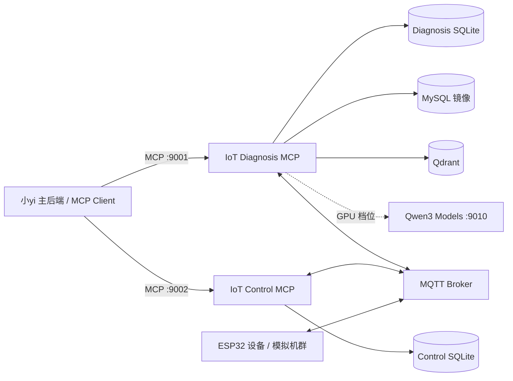

# 小yi MCP Services

小yi 的 IoT 能力层，包含两个相互独立的 Streamable HTTP MCP 服务：

- **IoT Diagnosis MCP**：汇集设备状态、遥测、日志、知识文档和历史案例，完成检索与故障诊断。
- **IoT Control MCP**：按风险等级执行修复动作、管理人工审批，并验证设备是否恢复。

两者通过 MQTT Topic 契约协作，不直接调用彼此。修复成功后，Control MCP 发布完成事件，Diagnosis MCP 将结果沉淀为可检索的已验证案例，形成“诊断 → 决策 → 执行 → 验证 → 学习”的闭环。

## 核心能力

- MCP Python SDK 2.x + Streamable HTTP 传输。
- 15 个诊断/知识工具和 6 个设备控制工具。
- 结构感知分块以及 Dense + BM25 + RRF + Reranker 混合检索。
- 无网络、无模型下载的确定性检索，以及可选的 Qwen3 GPU 检索服务。
- SQLite 事实源、MySQL 镜像、Qdrant 向量索引和持久化 outbox。
- 低风险动作自动执行，高风险动作必须经人工批准。
- 设备命令回执、恢复窗口验证和自动案例沉淀。
- SQLite schema 迁移、数据保留、外部存储重建、健康检查和离线模型缓存校验。
- 单设备模拟器及包含 12 台 ESP32 的可配置模拟机群。

## 架构



| 服务 | MCP 端点 | 健康检查 | 就绪检查 |
| --- | --- | --- | --- |
| Diagnosis MCP | `http://127.0.0.1:9001/mcp` | `/health` | `/ready` |
| Control MCP | `http://127.0.0.1:9002/mcp` | `/health` | `/ready` |
| Retrieval Models（可选） | Embeddings `/v1/embeddings`；Rerank `/rerank` | `/live` | `/ready` |

## 快速开始

### 推荐：通过主项目 Docker Compose 启动

主项目负责 MySQL、Qdrant、MQTT、两个 MCP 服务和模拟机群的完整编排：

```powershell
git clone https://github.com/fireworksfade/xiaoyi.git
cd xiaoyi
git clone https://github.com/fireworksfade/xiaoyi-mcp-services.git mcp-services
docker compose up -d --build
docker compose ps
```

首次启动或重建数据卷后，在主项目中注册 MCP 服务与工具策略：

```powershell
docker compose exec backend python scripts/bootstrap_local_mcp.py
```

Compose 会在服务启动前自动执行数据库迁移。默认使用 Portable 检索，无需 GPU 或模型下载。

### 独立运行

需要 Python `>= 3.12`。先创建环境并安装依赖：

```powershell
git clone https://github.com/fireworksfade/xiaoyi-mcp-services.git
cd xiaoyi-mcp-services
python -m venv .venv
.venv\Scripts\python -m pip install -e ".[dev]"
.venv\Scripts\python -m scripts.migrate upgrade --service diagnosis
.venv\Scripts\python -m scripts.migrate upgrade --service control
```

分别在两个终端中启动服务：

```powershell
# Terminal 1
.venv\Scripts\python -m iot_diagnosis.server

# Terminal 2
.venv\Scripts\python -m iot_control.server
```

独立运行时 Diagnosis MCP 默认使用本地 SQLite、hash embedding 和 weighted reranker。Control MCP 要真正下发命令并通过 `/ready` 检查，需要启动 MQTT Broker 并设置 `MQTT_ENABLED=true`。`.env.example` 是配置参考；服务读取进程环境变量，不会自动加载 `.env` 文件。

## MCP 工具

### Diagnosis MCP（15 个）

| 类别 | 工具 | 用途 |
| --- | --- | --- |
| 诊断 | `diagnose_fault` | 聚合实时状态、日志和检索证据，返回结构化诊断 |
| 诊断 | `get_diagnosis_trace` | 查询路由、最终上下文、耗时、Token 与错误快照 |
| 设备 | `get_device_status`、`list_devices` | 查询单设备或发现设备，可按类型和在线状态过滤 |
| 日志 | `get_device_logs` | 获取设备近期日志，可按级别过滤 |
| 知识 | `search_knowledge`、`list_knowledge_documents` | 检索知识或分页查看知识目录 |
| 案例 | `search_fault_cases`、`list_fault_cases` | 检索或分页查看已验证案例 |
| 历史 | `list_diagnoses` | 按设备、故障类型和执行状态查看诊断记录 |
| 写入 | `add_verified_fault_case` | 写入人工确认且包含确认人的故障案例 |
| 写入 | `ingest_knowledge_text` | 摄取文本/Markdown 并执行结构感知分块 |
| 删除 | `delete_knowledge_document`、`delete_fault_case` | 同步删除 SQLite、MySQL 镜像和 Qdrant 数据 |
| 维护 | `rebuild_vector_index` | 以 SQLite 为准批量重建 Qdrant 索引 |

所有列表工具均支持 `limit`/`offset` 分页。写入和删除工具应由 MCP Client 按风险策略显式授权，不应默认暴露给 Agent。

### Control MCP（6 个）

| 工具 | 用途 |
| --- | --- |
| `list_device_actions` | 返回动作目录、风险级别、参数和适用故障类型 |
| `execute_device_action` | 直接执行低风险动作；高风险动作会被拒绝 |
| `create_remediation_proposal` | 为高风险动作创建待审批提案 |
| `get_action_result` | 按命令 ID 或提案 ID 查询执行和验证状态 |
| `list_remediation_proposals` | 按状态分页查看修复提案 |
| `decide_remediation_proposal` | 批准或拒绝提案，仅供已授权后端调用 |

内置动作：

| 风险 | 动作 | 参数 |
| --- | --- | --- |
| 低 | `reconnect_mqtt` | 无 |
| 低 | `reconnect_wifi` | 无 |
| 低 | `calibrate_sensor` | 无 |
| 低 | `set_reporting_interval` | `seconds`：1–3600 |
| 高 | `restart_device` | 无，必须审批 |
| 高 | `update_firmware` | `version`，必须审批 |

修复命令必须携带本轮 `diagnosis_id`。Control MCP 会向 Diagnosis MCP 验证该诊断存在、成功且属于同一设备；恢复成功后，Diagnosis MCP 会按这个精确 ID 把闭环结果保存为已验证案例，不再按设备和时间窗口猜测关联。

## 代码结构

### 模块化设计

**IoT Diagnosis MCP**
```
iot_diagnosis/
├── server.py                # MCP 服务器入口
├── simulator/               # 设备模拟器 (模块化)
│   ├── models.py            # 设备画像与状态
│   ├── command_handler.py   # 命令处理
│   ├── telemetry.py         # 遥测数据生成
│   ├── device_simulator.py  # 单设备模拟器
│   ├── fleet_loader.py      # 机群配置加载
│   └── cli.py               # CLI 入口
├── external/                # 外部存储 (模块化)
│   ├── mysql_mirror.py      # MySQL 镜像同步
│   ├── qdrant_store.py      # Qdrant 向量存储
│   └── manager.py           # 统一管理
├── repositories/            # 数据访问层 (Mixin 模式)
│   ├── device_state.py      # 设备状态管理
│   ├── knowledge_cases.py   # 知识与案例
│   ├── external_sync.py     # 外部同步
│   └── diagnosis_records.py # 诊断记录
├── retrieval/               # 混合检索
│   ├── hybrid.py            # 混合检索编排
│   ├── dense.py             # Dense 召回
│   ├── bm25.py              # BM25 召回
│   └── fusion.py            # RRF 融合
└── chunking/                # 结构感知分块
    ├── token_chunker.py     # 分块器
    └── markdown_parser.py   # Markdown 解析
```

**IoT Control MCP**
```
iot_control/
├── server.py                # MCP 服务器入口
├── repository.py            # 命令与提案管理
├── actions.py               # 动作目录
├── diagnosis_verifier.py    # 诊断验证
└── mqtt.py                  # MQTT 集成
```

**公共模块**
```
common/
├── migrations.py            # SQLite/MySQL 迁移
├── datetime_utils.py        # 时间工具函数
└── results.py               # 结果封装
```

### 向后兼容

所有模块化重构保持完整的向后兼容性：
```python
# 旧导入继续工作
from iot_diagnosis.simulator import DeviceSimulator, load_fleet
from iot_diagnosis.external import MySQLMirror, QdrantVectorStore

# 新导入也支持
from iot_diagnosis.simulator.device_simulator import DeviceSimulator
from iot_diagnosis.external.mysql_mirror import MySQLMirror
```

## 混合 RAG

默认检索链路：

```text
结构感知分块
  → Dense 召回 + SQLite FTS5/BM25 召回
  → RRF 融合与去重
  → Reranker 重排
  → Top-K 证据
```

- 分块保留 Markdown 标题层级、代码块、日志行、排查步骤和表格边界。
- 默认块大小为 512 token、重叠 64 token，可用 `RAG_CHUNK_SIZE` 和 `RAG_CHUNK_OVERLAP` 调整。
- BM25 对下划线技术词与 CJK 二元组做展开，可检索 `ERR_CONNECTION_RESET`、`mosquitto.conf` 和中文短语。
- `RAG_RETRIEVAL_STRATEGY` 支持 `dense`、`sparse`、`hybrid`，默认 `hybrid`。
- `RAG_ENABLE_SPARSE`、`RAG_ENABLE_RRF` 和 `RAG_ENABLE_RERANKER` 可独立关闭组件，用于评测或回退。
- `RAG_RETRIEVAL_DEBUG=true` 时返回候选的 dense/sparse rank、RRF 和 reranker 调试信息。
- 实时 RSSI、温度、在线状态、WiFi/MQTT 状态问题由 Rule Router 直接回答，不调用诊断 LLM。

### 检索部署档位

| 档位 | Embedding / Reranker | 向量维度 | 要求 |
| --- | --- | --- | --- |
| Portable（默认 Compose） | hash / weighted | 384 | 无 GPU、无模型下载 |
| GPU | Qwen3-Embedding-0.6B / Qwen3-Reranker-0.6B | 1024 | NVIDIA runtime，建议至少 4 GiB 空闲显存 |
| GPU offline | 已缓存的 Qwen3 模型 | 1024 | 完整模型缓存，禁止联网下载 |

在主项目目录中切换档位：

```powershell
# GPU
docker compose -f compose.yaml -f compose.retrieval-gpu.yaml up -d --build

# GPU + offline
docker compose -f compose.yaml -f compose.retrieval-gpu.yaml -f compose.retrieval-offline.yaml up -d --build
```

Portable 和 GPU 档位应使用不同的 Qdrant collection，主项目默认分别为 `iot_diagnosis_portable` 和 `iot_diagnosis_qwen3`，避免 384/1024 维向量混写。GPU 档位首次下载约 2.5 GiB 模型，典型冷启动时间为 5–20 分钟。

模型缓存模式由 `MODEL_CACHE_MODE=download|offline` 控制。发布离线部署前可检查缓存：

```powershell
.venv\Scripts\python -m scripts.check_model_cache --models-dir C:\path\to\model-cache
```

缓存完整时退出码为 0；否则退出码为 1。offline 模式缓存不完整时 `/ready` 返回 503 和 `MODEL_CACHE_INCOMPLETE`，不会联网下载。

## 诊断与存储

Diagnosis MCP 以 SQLite 为本地事实源。配置 MySQL 或 Qdrant 后，外部写入失败会持久化到 SQLite outbox，并由后台任务按 `DIAGNOSIS_SYNC_RETRY_SECONDS` 重试。

| 数据 | SQLite | MySQL | Qdrant |
| --- | --- | --- | --- |
| 设备状态、日志、诊断记录 | 事实源 | 镜像 | — |
| 知识文档与分块 | 事实源 | 镜像 | 向量索引 |
| 已验证故障案例 | 事实源 | 镜像 | 向量索引 |
| 修复命令与提案 | Control SQLite 事实源 | — | — |

Repository 初始化不会执行全库外部同步。需要重建 MySQL 镜像时使用显式、可恢复的分页任务：

```powershell
.venv\Scripts\python -m scripts.rebuild_external --list
.venv\Scripts\python -m scripts.rebuild_external --entity device_log --batch-size 500
.venv\Scripts\python -m scripts.rebuild_external --entity knowledge_document --dry-run
```

Qdrant 向量索引应通过 MCP 工具 `rebuild_vector_index` 以 SQLite 为准重建。

## 知识摄取

支持 `.txt`、`.md`、`.markdown` 和 `.pdf`。相同 `document-id` 会原子替换已有分块：

```powershell
.venv\Scripts\python -m scripts.ingest_documents .\docs\mqtt.md --source mqtt_docs --document-id mqtt-guide --title "MQTT Guide"
```

仓库在 `knowledge/` 中附带 32 份 ESP32、ESP-IDF、MQTT 和 Mosquitto 诊断资料，可重复摄取：

```powershell
.venv\Scripts\python -m scripts.ingest_recommended_documents
```

稳定的文档 ID 保证重复执行会替换原有分块，而不是生成重复文档。

## MQTT 与模拟器

设置 `MQTT_ENABLED=true` 后，Diagnosis MCP 订阅：

```text
iot/{device_id}/status
iot/{device_id}/telemetry
iot/{device_id}/logs
iot/{device_id}/fault
iot/{device_id}/heartbeat
iot/{device_id}/remediation
```

Control MCP 使用以下控制主题：

```text
iot/{device_id}/cmd
iot/{device_id}/cmd_ack
iot/{device_id}/remediation
iot/{device_id}/remediation_case
```

运行单设备模拟器：

```powershell
$env:MQTT_ENABLED = "true"
.venv\Scripts\python -m iot_diagnosis.simulator --device-id ESP32_05 --scenario mqtt_timeout
```

运行 `iot_diagnosis/fleet.json` 定义的 12 台设备机群：

```powershell
.venv\Scripts\python -m iot_diagnosis.simulator --host 127.0.0.1 --fleet iot_diagnosis/fleet.json
```

内置场景包括 `normal`、`mqtt_timeout`、`wifi_weak`、`sensor_error`、`unstable`、`memory_leak` 和 `watchdog_reset`。模拟器还支持 `inject_fault` 下行动作，可动态注入或清除故障。

在 Compose 的 Diagnosis 容器中可批量生成真实闭环案例：

```powershell
docker compose exec iot-diagnosis-mcp python scripts/generate_fault_cases.py --rounds 2
docker compose exec iot-diagnosis-mcp python scripts/purge_fault_cases.py
```

## 数据库迁移与保留策略

查看、预演、应用迁移或备份 SQLite：

```powershell
.venv\Scripts\python -m scripts.migrate status --service diagnosis
.venv\Scripts\python -m scripts.migrate upgrade --service diagnosis --dry-run
.venv\Scripts\python -m scripts.migrate upgrade --service diagnosis
.venv\Scripts\python -m scripts.migrate backup --service diagnosis --target .\data\diagnosis-backup.db

.venv\Scripts\python -m scripts.migrate status --service control
.venv\Scripts\python -m scripts.migrate upgrade --service control
```

数据保留默认只统计、不删除：

```powershell
.venv\Scripts\python -m scripts.retention --dry-run
```

确认备份与候选数量后，设置 `DIAGNOSIS_RETENTION_DELETE_ENABLED=true`，再显式执行：

```powershell
$env:DIAGNOSIS_RETENTION_DELETE_ENABLED = "true"
.venv\Scripts\python -m scripts.retention --execute
```

默认保留期：遥测和 INFO 日志 14 天、ERROR 日志 90 天、诊断记录 180 天、已完成 outbox 7 天。可通过 `.env.example` 中的 `DIAGNOSIS_*_RETENTION_*` 变量调整。

## 评测与协议验收

运行确定性 RAG、Router 和 Diagnosis 评测：

```powershell
.venv\Scripts\python -m scripts.evaluate_rag --database .\data\iot_diagnosis_eval.db
```

报告包含 Recall@K、Precision@K、MRR、Hit Rate、Router/Source/Diagnosis Accuracy、延迟和 Token 使用。可用 `--strategy dense|sparse|hybrid` 对比检索策略。

对比 384/512/768/1024 chunk size：

```powershell
.venv\Scripts\python -m scripts.evaluate_chunk_sizes
```

在主项目 GPU Compose 档位中运行真实 Qwen3 检索评测：

```powershell
docker compose -f compose.yaml -f compose.retrieval-gpu.yaml exec iot-diagnosis-mcp python /app/scripts/evaluate_rag.py --profile live-retrieval --database /app/data/iot_diagnosis.db
```

对已运行的 Diagnosis MCP 做在线协议验收：

```powershell
.venv\Scripts\python scripts\smoke_diagnosis_server.py
.venv\Scripts\python scripts\smoke_diagnosis_server.py --timeout 180
```

## 配置与鉴权

常用配置分组：

| 分组 | 关键变量 |
| --- | --- |
| Diagnosis 服务 | `DIAGNOSIS_HOST`、`DIAGNOSIS_PORT`、`DIAGNOSIS_DATABASE_PATH` |
| 外部存储 | `DIAGNOSIS_MYSQL_DSN`、`DIAGNOSIS_QDRANT_URL`、`DIAGNOSIS_QDRANT_COLLECTION` |
| 诊断 LLM | `DIAGNOSIS_LLM_BASE_URL`、`DIAGNOSIS_LLM_MODEL`、`DIAGNOSIS_LLM_API_KEY` |
| Embedding | `DIAGNOSIS_EMBEDDING_PROVIDER`、`DIAGNOSIS_EMBEDDING_BASE_URL`、`DIAGNOSIS_EMBEDDING_MODEL` |
| Reranker | `DIAGNOSIS_RERANKER_PROVIDER`、`DIAGNOSIS_RERANKER_URL` |
| Control 服务 | `CONTROL_HOST`、`CONTROL_PORT`、`CONTROL_DATABASE_PATH` |
| MQTT | `MQTT_HOST`、`MQTT_PORT`、`MQTT_ENABLED`、`MQTT_USERNAME`、`MQTT_PASSWORD`、`MQTT_USE_TLS` |

配置 `DIAGNOSIS_LLM_API_KEY` 和 `DIAGNOSIS_LLM_MODEL` 后，复杂问题会调用兼容 Chat Completions 的 Router 与 Diagnosis；未配置或调用失败时使用启发式回退，并在结果中记录回退原因。

生产环境可分别设置 `DIAGNOSIS_MCP_BEARER_TOKEN` 和 `CONTROL_MCP_BEARER_TOKEN`。同时把对应的 `*_MCP_PUBLIC_URL` 设置为客户端可访问的服务 URL。认证只保护 `/mcp`；健康端点仍可供探针访问。

## 开发验证

```powershell
.venv\Scripts\python -m ruff check common iot_diagnosis iot_control model_service scripts tests
.venv\Scripts\python -m ruff format --check common iot_diagnosis iot_control model_service scripts tests
.venv\Scripts\python -m mypy common iot_diagnosis iot_control model_service
.venv\Scripts\python -m pytest -q tests
```

## 项目结构

| 路径 | 职责 |
| --- | --- |
| `common/` | 共享结果结构与 SQLite 迁移基础设施 |
| `iot_diagnosis/` | 诊断 MCP、Repository、RAG、MQTT 消费和模拟器 |
| `iot_control/` | 控制 MCP、动作策略、提案、命令回执与恢复验证 |
| `model_service/` | Qwen3 Embedding/Reranker HTTP 服务及缓存检查 |
| `knowledge/` | 可摄取的 ESP32/MQTT/Mosquitto 资料 |
| `evals/` | 检索、路由与诊断评测数据 |
| `scripts/` | 迁移、摄取、评测、重建、保留与案例维护脚本 |
| `tests/` | 单元、集成、迁移与可靠性测试 |

本地 MQTT 匿名连接只适合开发环境。生产环境必须启用身份认证、TLS 和 Topic ACL，并通过已授权的主后端限制写入、删除、审批和设备控制工具。
